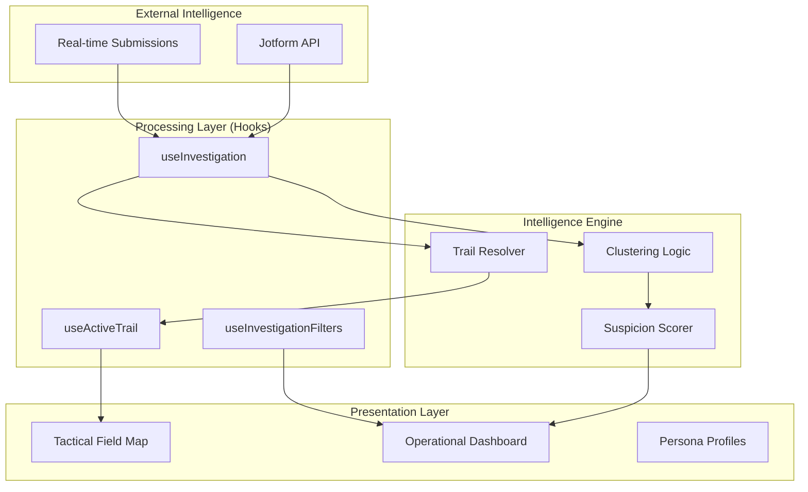

# 🕵️ PODO: Investigation Command Center

[](https://nextjs.org/)
[](https://tailwindcss.com/)
[](https://github.com/denizscodes/2026-frontend-challenge-ankara)

> **OPERATION: FIND PODO**
> A high-precision, data-driven intelligence gathering and record-linking platform designed to track sightings and movement patterns for a missing pet named **Podo**.

---

## 🎯 Project Vision

This is not just a dashboard; it's a **Tactical Command Center**. Built for the **2026 Frontend Challenge**, this application demonstrates how to transform raw, unstructured submission data into actionable intelligence using advanced frontend engineering and spatiotemporal analysis.

## 🚀 Key Features

### 📡 Podo's Active Trail (NEW)
*   **Chronological Playback**: A presentation-style "Step-by-Step" movement tracker.
*   **Tactical Follow**: Auto-zoom and follow logic that centers the map on the latest movement node.
*   **Path building**: Real-time path visualization as you progress through the investigation timeline.

### 🔍 Intelligence Persona Engine
*   **Identity Resolution**: Automatically links reports from different forms/sources based on email, phone, or name fuzzy matching.
*   **Threat Assessment**: Calculates suspicion scores using geometric path projection and proximity algorithms.
*   **Reliability Index**: Scores informants based on the density and verification of their data.

### 🛰️ Tactical Field Map
*   **Live Tracking**: Visualizes the movements of Podo vs. suspicious personas.
*   **Corridor Analysis**: Detects "Persistent Following" and "Trajectory Matches" using geometric path projection.
*   **Visual Legend**: High-contrast, tactical categorization of intelligence nodes.

---

## 🏗️ System Architecture

### High-Level Flow


### Data Normalization & Clustering
The system implements a multi-step pipeline to resolve identities:
1.  **Normalization**: Standardizes raw Jotform keys (e.g., "Adınız", "Email Address", "Telefon") into a unified schema.
2.  **Overlap Detection**: Compares identifiers (Email, Phone, Name) across all submissions.
3.  **Spatiotemporal Clustering**: Links reports to the same persona even without identifiers if they share specific location/time corridors.

---

## 🛠️ Tech Stack

| Category | Technology |
| :--- | :--- |
| **Core** | Next.js 14 (App Router), TypeScript |
| **Styling** | Tailwind CSS (Custom Tactical Design System) |
| **Mapping** | React Leaflet, OpenStreetMap |
| **State** | Custom React Hooks (Architecture-First) |
| **Animations** | Framer Motion (Micro-interactions) |
| **Intelligence** | Jotform API |

---

## 📦 Tactical Setup

### 1. Requisition the Code
```bash
git clone https://github.com/denizscodes/2026-frontend-challenge-ankara.git
cd 2026-frontend-challenge-ankara
```

### 2. Supply Installation
```bash
npm install
```

### 3. Intelligence Credentials
Create a `.env.local` file with your Jotform credentials:
```env
NEXT_PUBLIC_JOTFORM_API_KEY=your_api_key_here
NEXT_PUBLIC_JOTFORM_FORM_IDS=form_id_1,form_id_2
```

### 4. Initiate Command Center
```bash
npm run dev
```

---

## 📐 Implementation Principles

*   **Logic Separation**: 100% of business logic, data filtering, and clustering resides in the `/hooks` directory. Components are strictly for presentation.
*   **Responsive Operationality**: Fully optimized for field tablets and high-density monitors.
*   **Error Resiliency**: Implements a "Graceful Degradation" strategy for API failures and missing spatial data.

---

## 🧪 Operational Testing

Validate the intelligence engine:
```bash
npm test
```

Tests cover:
*   Identity resolution accuracy.
*   Suspicion score calculation logic.
*   Filter state persistence.

---

**© 2026 Podo Investigation Force.** *Intelligence remains our primary weapon.*
